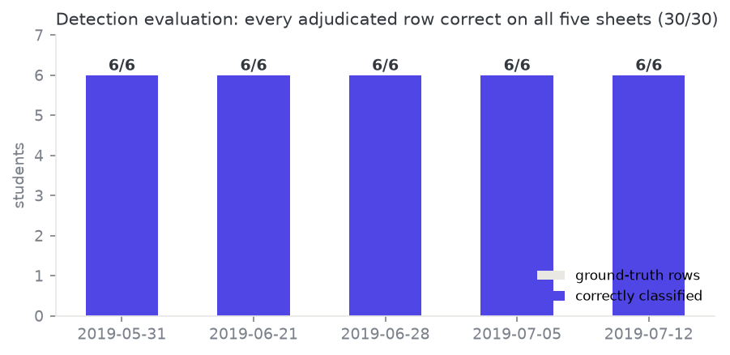
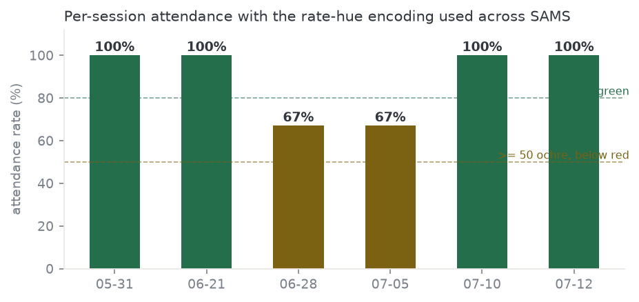
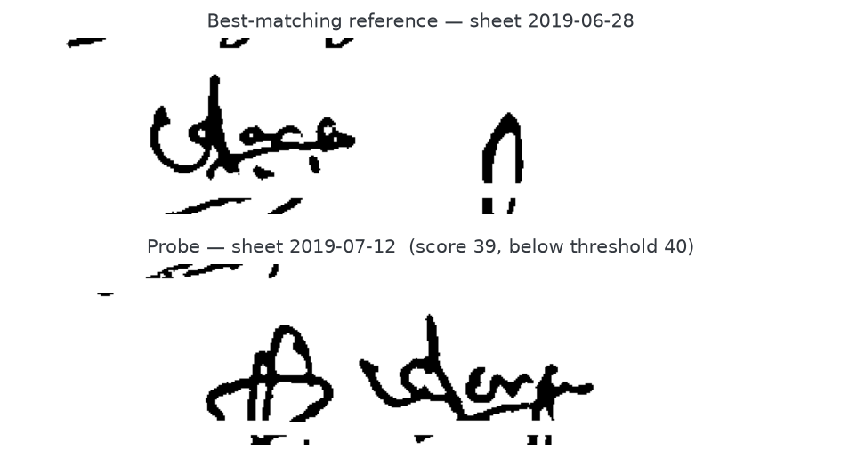

# 📋 SAMS — Smart Attendance Management System

A Python image-processing and data-visualization system that reads a **photographed class Signing
Sheet**, works out which students actually signed, stores the attendance records, and turns them
into charts you can act on — plus a signature check that flags sheets somebody may have signed for
a friend.

Built for **CS402.3 — Computer Graphics and Visualization** at NSBM Green University Town.

<p align="center">
  
  
  
  
  
  
  
</p>

<div align="center">
  
</div>

---

## 📖 Overview

Attendance is still taken on paper in a lot of classrooms. Somebody then has to squint at the sheet
and type it all in. SAMS replaces that step: photograph the sheet with a phone, hand the photo to
SAMS along with the session's `info.xml` roster, and it does the rest.

- 🖼️ **Reads the sheet as an image** — a seven-stage OpenCV pipeline cleans the photo, straightens
  it, finds the table, and inspects every signature cell individually.
- ✅ **Decides per student** — each cell comes back **Present**, **Absent**, or **Ambiguous**.
  Ambiguous is a real verdict, not a rounding error: a faint smudge gets escalated to the operator
  instead of being quietly guessed.
- 💾 **Keeps the records** — attendance is written to a local SQLite database, so sessions
  accumulate into a history you can query later.
- 📊 **Visualizes the history** — per-student attendance timelines, per-session rate bars, an
  attendance-trend chart, and a dashboard that surfaces who is falling behind.
- ✍️ **Checks the signatures** — each detected signature is compared against that student's
  reference signatures and scored, so an unusual signature gets flagged for a human to look at.

There are two front-ends and **one engine**. The command-line tools are the graded deliverable; the
Streamlit web app is an optional extra that calls exactly the same code, so both always agree.

---

## ✨ Features

### 🖼️ Image processing

- **Seven-stage pipeline** — Original → Greyscale → Denoised → Binarized → Deskewed → Table Grid →
  Per-Cell Inspection. Every stage is saved as a PNG so the work is inspectable, not a black box.
- **Adaptive binarization** rather than a global Otsu threshold, because a phone photo of a sheet on
  a desk is lit unevenly — one side of the page is often noticeably darker than the other.
- **Automatic deskew** — a Hough transform over the long near-horizontal grid lines measures how
  crooked the photo is, and the page is rotated back level.
- **Morphological table localization** — horizontal and vertical rules are pulled out with
  directional morphology, clustered into tables, and the five-column Student Table
  (`No | Student No | Title | Student Name | Signature`) is picked out from below the four-column
  metadata row. **No OCR and no hard-coded pixel coordinates** — the sheet can move around in frame.
- **Connected-component ink measurement** — each signature cell's ink is measured by component, and
  a signature that spills over a row line is attributed to whichever cell holds most of its area.
- **Honest three-way verdict** — coverage ≥ 3.0% is Present, ≤ 1.5% is Absent, anything between is
  **Ambiguous** and handed to the operator with the actual crop shown.

### 📊 Data visualization

- **Per-student attendance timeline** — sessions along the x-axis, Present / Ambiguous / Absent as
  labelled bands, with ✓ / ? / ✕ glyph markers so the chart still reads correctly in greyscale or
  with colour-vision deficiency. Colour is never the only signal.
- **Per-session attendance rate bars** with a consistent hue encoding used everywhere in the
  system — green at or above 80%, ochre at or above 50%, red below.
- **Attendance-trend chart** across all recorded sessions on the history page.
- **Dashboard stat tiles** — roster size, sessions recorded, average attendance, and a
  "needs attention" count combining low attendance with signature alerts.
- **One figure, two front-ends** — the chart builders return a Matplotlib `Figure` and never call
  `plt.show()`, so the CLI window and the web page render the identical figure object.

### ✍️ Signature verification

- Each detected signature is normalized (binarize → despeckle → crop to the ink bounding box →
  fit to a fixed size preserving aspect ratio), described with a **HOG descriptor**, and compared to
  the student's reference signatures by **cosine similarity**.
- The best-scoring reference wins; the score is reported on a 0–100 scale with the decision
  threshold drawn in, so a borderline call is visibly borderline.
- Threshold `0.40` sits at the measured equal-error operating point. Measured **AUC ≈ 0.74** — good
  enough to raise a flag for a human, and deliberately *not* presented as proof of forgery.

### 💾 Records and storage

- SQLite, upserted on `(student_index, sheet_id)` — reprocessing a sheet updates it instead of
  duplicating it, and an operator's manual resolution is preserved unless `--overwrite` is passed.
- Student lookup accepts either index form: the short roster ordinal (`001`, or even `1`) or the
  full 8-digit student index (`10000409`).
- Signature images are stored as **paths, never blobs**, so the database stays small and the crops
  stay viewable as ordinary files.

---

## 🏗️ Architecture

<div align="center">
  
</div>

`sams_core/` is the whole system. It is the only package that imports `cv2`, `sqlite3`, or
`matplotlib`, and it never renders anything itself — it returns data and `Figure` objects. Both
front-ends are thin adapters over it:

- `cli_display.py` opens the OpenCV stage windows, prints the tables, and shows the figures.
- `webui/` has a Streamlit page paired with a Streamlit-free `*_logic.py` twin for every screen, so
  the page logic is unit-testable without a browser.

A dedicated test (`tests/test_parity.py`) asserts the CLI and the web app produce the same data for
the same inputs.

---

## 🖼️ Application Screens

<div align="center">

<table>
  <tr>
    <td align="center" width="33%">
      <br/>
      <strong>Dashboard</strong><br/>
      <sub>Stat tiles, latest session, who needs attention</sub>
    </td>
    <td align="center" width="33%">
      <br/>
      <strong>Mark today's attendance</strong><br/>
      <sub>Sheet photo + Info File staged and ready</sub>
    </td>
    <td align="center" width="33%">
      <br/>
      <strong>Seven pipeline stages</strong><br/>
      <sub>Every stage shown, then the per-student results</sub>
    </td>
  </tr>
  <tr>
    <td align="center" width="33%">
      <br/>
      <strong>Session history</strong><br/>
      <sub>Attendance trend and per-session rates</sub>
    </td>
    <td align="center" width="33%">
      <br/>
      <strong>Look up a student</strong><br/>
      <sub>The attendance timeline, banded and glyphed</sub>
    </td>
    <td align="center" width="33%">
      <br/>
      <strong>Check a signature</strong><br/>
      <sub>Reference vs sheet, scored against the threshold</sub>
    </td>
  </tr>
</table>

**On a phone**

<table>
  <tr>
    <td align="center">
      <br/>
      <sub>Dashboard</sub>
    </td>
    <td align="center">
      <br/>
      <sub>Results</sub>
    </td>
    <td align="center">
      <br/>
      <sub>History</sub>
    </td>
    <td align="center">
      <br/>
      <sub>Lookup</sub>
    </td>
  </tr>
</table>

</div>

Every page works at 360 px with no horizontal scrolling, and every control is at least 44 px tall —
both asserted by `tests/test_webui_accessibility.py`, not just eyeballed.

---

## 🔬 The seven-stage pipeline

Each stage is displayed live (unless suppressed) and written to
`output/<sheet-date>/01-original.png` … `07-per-cell-inspection.png`.

| # | Stage | What it does | Technique |
|---|-------|--------------|-----------|
| 1 | **Original** | The photo as loaded, after the sheet boundary is cropped out of the background | Largest-contour sheet detection with padding |
| 2 | **Greyscale** | Drops colour — signature ink is a shape problem, not a colour one | `cv2.cvtColor` |
| 3 | **Denoised** | Removes camera speckle that would otherwise read as ink | Median blur, kernel 5 |
| 4 | **Binarized** | Separates ink from paper under uneven desk lighting | Adaptive Gaussian threshold, block 35, C 11 |
| 5 | **Deskewed** | Rotates the crooked photo back level | Hough lines over long near-horizontal rules; corrects above 0.5°, ignores beyond 20° |
| 6 | **Table Grid** | Finds the Student Table and every cell in it | Directional morphology → line clustering → pick the 5-column table below the 4-column metadata row |
| 7 | **Per-Cell Inspection** | Measures ink per signature cell and classifies each student | Connected components, majority-area attribution, coverage thresholds |

Thresholds and kernels all live in one place — `sams_core/config.py` — with the reasoning for each
value written next to it. No pipeline module contains a bare numeric literal.

---

## 📊 Results and accuracy

<div align="center">
  
</div>

Detection is checked against a hand-adjudicated answer key
(`tests/data/ground_truth.csv`, 30 rows across the five sample sheets, adjudicated *before* the
thresholds were tuned and then independently re-adjudicated). Current result: **30/30 — 100%**,
enforced as a test so it cannot silently regress.

```bash
python evaluate_detection.py        # per-sheet table + output/detection_results.csv
python evaluate_verification.py     # signature score distribution figure
```

<div align="center">
  
</div>

The same rate-hue encoding is used by the dashboard, the history page, and the report figures — one
visual language across the whole system.

<div align="center">
  
</div>

This is what a signature alert actually looks like: the probe scored **39** against a threshold of
**40**. A near-miss like this is exactly why the verdict goes to a person rather than straight into
the record.

---

## ⚙️ Installation

**Requirements**

- Python 3.12 or 3.13 (the fresh-machine protocol was verified on 3.13)
- Windows and macOS need nothing else — everything installs from `requirements.txt`. Minimal Linux
  servers also need OpenCV's system libraries: `sudo apt install libgl1 libglib2.0-0`.

**Install — one step**

```bash
pip install -r requirements.txt
```

That installs the pinned engine and CLI dependencies only (OpenCV, NumPy, Matplotlib). **No web
framework is needed to run or grade the prototype.**

---

## ▶️ Usage — the three commands

All three run from the project root. Sample inputs live in `sample_signin-sheets/` — five real
Signing Sheet photos `1.jpeg`–`5.jpeg`, each with its Info File `1.xml`–`5.xml`.

### 1. Process a Signing Sheet

Detects each student's signature cell and saves the Attendance Records to the local database
(`sams.db`, created automatically on first run). The brief's exact invocation works out of the box —
`10.07.2019.png` and `info.xml` ship in the project root, and the filename's date becomes the Sheet
Identifier because this Info File carries no session date:

```bash
python sams.py 10.07.2019.png info.xml
```

The seven stages display live and are saved under `output/<sheet-date>/`. The per-student summary
prints Present / Absent / Ambiguous, and the signature crops are saved for verification. The sample
sheets process the same way:

```bash
python sams.py sample_signin-sheets/1.jpeg sample_signin-sheets/1.xml
```

Process all five for the full experience:

```bash
python sams.py sample_signin-sheets/1.jpeg sample_signin-sheets/1.xml
python sams.py sample_signin-sheets/2.jpeg sample_signin-sheets/2.xml
python sams.py sample_signin-sheets/3.jpeg sample_signin-sheets/3.xml
python sams.py sample_signin-sheets/4.jpeg sample_signin-sheets/4.xml
python sams.py sample_signin-sheets/5.jpeg sample_signin-sheets/5.xml
```

Flags (`sams.py` only):

| Flag | Effect |
|------|--------|
| `--no-display` | Suppresses the live stage windows |
| `--overwrite` | Replaces operator-resolved rows when reprocessing a sheet |
| `--date` | Overrides the Sheet Identifier |

### 2. Query a student's attendance and timeline chart

Either index form works — the short roster ordinal and the 8-digit student index return identical
records:

```bash
python infovis.py 001
python infovis.py 10000409
```

Prints every saved Attendance Record for that student and opens the per-session timeline chart with
the attendance rate. The chart window is suppressed on headless sessions.

### 3. Verify a signature

Compares the student's probe signature (cropped by step 1) against their Reference Signatures and
reports a match verdict:

```bash
python investigate.py 001
```

Reference Signatures live under `references/<student-index>/`.

### Running fully windowless

For CI or a server with no display:

```bash
SAMS_HEADLESS=1 python sams.py 10.07.2019.png info.xml   # bash
```

```powershell
$env:SAMS_HEADLESS="1"                                    # PowerShell
```

```
set SAMS_HEADLESS=1                                       :: cmd
```

---

## 🌐 Optional web UI

The browser front-end is a separate, optional install — the graded CLI path never touches it:

```bash
pip install -r requirements-web.txt
streamlit run webui/app.py
```

Run it **from the project root**, otherwise Streamlit won't find the theme in `.streamlit/` and
silently falls back to its defaults.

| Page | What it does |
|------|--------------|
| **Dashboard** | Quick actions, a date-range window, four stat tiles, the latest session's rate, and a "needs attention" panel combining low attendance with signature alerts |
| **Mark today's attendance** | Upload the sheet photo and Info File, watch the seven stages stream, review per-student results, export CSV. Ambiguous rows show the actual crop |
| **Session history** | Sessions grouped by Sheet Identifier, an attendance-trend chart, per-session rate bars, and a per-session student list |
| **Look up a student** | Student number in, the same Matplotlib timeline `infovis.py` renders out |
| **Check a signature** | Reference crop beside the sheet crop, the similarity score on a scale with the threshold marked, a plain-English verdict, and the other reference scores |

---

## 🧪 Tests

```bash
pip install -r requirements-dev.txt
pytest
```

**269 tests across 25 files.** The suite is fully headless — no windows open — and self-contained.
It includes the PRD §6.3 accuracy gate proving 100% classification accuracy on all five sample
sheets against the committed ground truth, plus CLI↔web parity, accessibility, and packaging checks.

---

## 🛠️ Technologies Used

- **Language**: Python 3.12 / 3.13
- **Image processing**: OpenCV 4.13 — morphology, adaptive thresholding, Hough transform,
  connected components, HOG descriptors
- **Numerics**: NumPy 2.5
- **Visualization**: Matplotlib 3.11 (Agg backend when headless)
- **Web UI**: Streamlit 1.59 — multipage, optional install
- **Database**: SQLite via the Python standard library
- **Config / roster input**: XML via `ElementTree`, hardened against DOCTYPE and entity-expansion
  attacks on uploaded files
- **Testing**: pytest 8.4
- **CI/CD**: GitHub Actions → Azure App Service

---

## 📁 Project structure

```
sams.py / infovis.py / investigate.py   thin CLI entry scripts (<50 lines each)
cli_display.py                          CLI rendering (windows, stdout, figures)
evaluate_detection.py                   detection accuracy harness
evaluate_verification.py                signature score-distribution harness
sams_core/                              the engine: pipeline, locate, detect,
                                        verification, repository, visualization, config
webui/                                  optional Streamlit front-end
  app.py                                page config + 5-page router
  pages/                                the five screens
  *_logic.py                            Streamlit-free logic twin per screen
sample_signin-sheets/                   five sample sheets + Info Files
10.07.2019.png + info.xml               the brief's verbatim-command inputs
references/                             COMMITTED Reference Signatures
                                        (investigate.py input — keep!)
tests/                                  pytest suite incl. the accuracy gate
docs/walkthrough/                       Playwright walkthrough + UI screenshots
docs/report/                            report figures and generator
.streamlit/config.toml                  the app theme
.github/workflows/deploy.yml            Azure deployment
output/  sams.db                        created at runtime (safe to delete)
```

---

## 🔧 Configuration

`sams_core/config.py` is the single source for every tunable. The ones you're most likely to touch:

| Setting | Default | What it controls |
|---------|---------|------------------|
| `SAMS_DB_PATH` (env) | `sams.db` | Where the attendance database lives |
| `SAMS_OUTPUT_DIR` (env) | `output/` | Where stage images and crops are written |
| `SAMS_HEADLESS` (env) | unset | Set to `1` to suppress all windows and force the Agg backend |
| `INK_COVERAGE_PRESENT_THRESHOLD` | `0.030` | Ink coverage at or above which a cell is Present |
| `INK_COVERAGE_ABSENT_THRESHOLD` | `0.015` | Ink coverage at or below which a cell is Absent |
| `SIMILARITY_THRESHOLD` | `0.40` | Signature match cut-off (measured equal-error point) |
| `LOW_ATTENDANCE_THRESHOLD` | `75` | Dashboard "needs attention" cut-off (in `webui/dashboard_logic.py`) |

The two ink thresholds have a comfortable margin around real data: genuine signatures measured at
5.1% coverage or more, empty cells at 1.0% or less — at least 1.5× clear of the boundary on both
sides.

---

## 🚀 Deployment

Pushing to `main` (or running the workflow manually) triggers `.github/workflows/deploy.yml`, which
prepares a server-safe build and deploys it to Azure App Service (`sams-cgv`):

1. Swaps `opencv-python` for `opencv-python-headless` — no display libraries on the server.
2. Folds the web dependencies into `requirements.txt`.
3. Zips the app, excluding `.git`, `.github`, `tests`, `docs`, and the sample sheets.
4. Deploys with `azure/webapps-deploy@v3` using the `AZUREAPPSERVICE_PUBLISHPROFILE` secret.

Branch flow: `Sprint-*` → `develop` → `UAT` → `main`.

---

## 📦 Submission packaging

The prototype ZIP contains the code, the samples, `10.07.2019.png` + `info.xml`, and `references/`
(a required input — **never exclude it**). Exclude the dev-only material: `.git/`, `.venv*/`,
`__pycache__/`, `.pytest_cache/`, `output/`, `sams.db`, `.claude/`, `_bmad/`, `_bmad-output/`,
`docs/`, internal notes (`TUNING_LOG.md`, `STORY_*.md`, `IMPLEMENTATION_*.md`,
`FINAL_DELIVERY_*.md`), and the coursework brief documents. The prototype ZIP plus the MS Word
report go into the outer ZIP for LMS. A fresh unzip of the prototype ZIP satisfies the
Install/Usage steps above with no further setup.

---

## 👥 Team Members

<div align="left">

|  |  |  |  |
|:---:|:---:|:---:|:---:|
| **Lakshitha Wijerathne** | **Jayani Adikari** | **Nethmi Jayasinghe** | **Ruwani Chandrarathne** |
| [@lakshitha-dev](https://github.com/lakshitha-dev) | [@JMAdikari](https://github.com/JMAdikari) | [@NethmiJayasinghee](https://github.com/NethmiJayasinghee) | [@RuwaniChandrarathne](https://github.com/RuwaniChandrarathne) |

|  |  |  |  |
|:---:|:---:|:---:|:---:|
| **Janandi Samarawickrama** | **Chamudi Rathnayake** | **Dhananja Gangoda** | **Imashi Chathurangi Gunarathna** |
| [@Janandie](https://github.com/Janandie) | [@ChamudiRathnayake](https://github.com/ChamudiRathnayake) | [@DhananjaGangoda](https://github.com/DhananjaGangoda) | [@Imashichathu](https://github.com/Imashichathu) |

</div>

All eight members contributed to both halves of the module — the image-processing pipeline and the
data-visualization work.

---

<div align="center">
  <sub><strong>CS402.3 — Computer Graphics and Visualization</strong><br/>
  NSBM Green University Town</sub>
</div>
