# 📋 SAMS — Smart Attendance Management System

Photograph a paper class attendance sheet, and SAMS works out who actually signed it, saves the
records, and turns them into charts.

Built for **CS402.3 — Computer Graphics and Visualization** at NSBM Green University Town.

<p align="center">
  
  
  
  
  
  
  
</p>

<div align="center">
  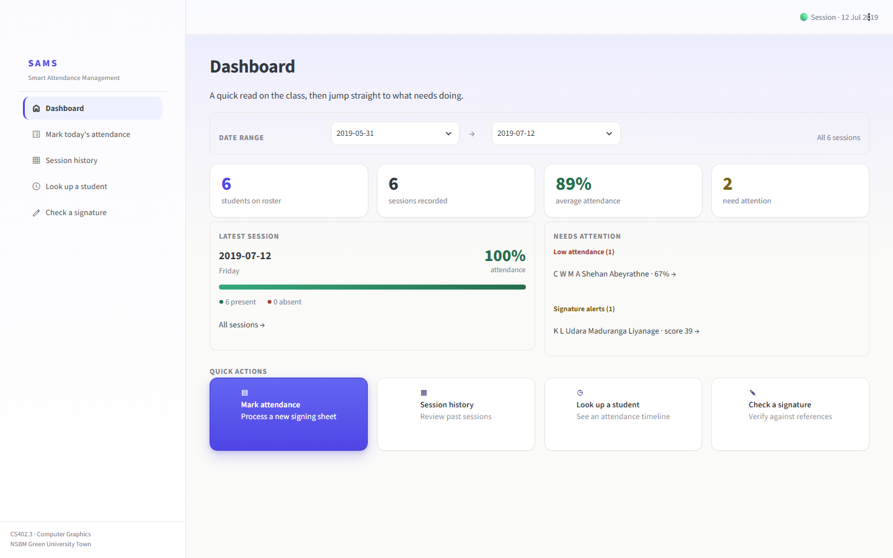
</div>

---

## 📖 Overview

Attendance is still taken on paper in a lot of classrooms, and somebody then has to squint at the
sheet and type it all in. SAMS replaces that step: hand it a phone photo of the sheet plus the
session's `info.xml` roster, and it reads the signatures, saves the attendance, and builds the
charts.

There are two front-ends and **one engine** — command-line tools and an optional web app that call
exactly the same code, so they always agree.

---

## ✨ What it does

- 🖼️ **Reads the sheet as an image** — a seven-stage pipeline cleans the photo, straightens it,
  finds the table, and inspects every signature cell on its own.
- 🎯 **Finds the table anywhere in frame** — no OCR and no hard-coded pixel coordinates, so the
  sheet doesn't have to be photographed the same way twice.
- ✅ **Decides per student** — Present, Absent, or **Ambiguous**. A faint smudge gets escalated to a
  human instead of being quietly guessed.
- 💾 **Keeps a history** — records go to a local SQLite database, so sessions build up over time.
- 📈 **Charts the history** — attendance timelines and rate bars, with ✓ / ? / ✕ markers and one
  consistent green / ochre / red encoding so colour is never the only signal.
- ✍️ **Flags odd signatures** — each signature is scored against that student's reference
  signatures, and a low score is raised for a person to check.

---

## 🖼️ Screens

<div align="center">

<table>
  <tr>
    <td align="center" width="33%">
      <br/>
      <strong>Dashboard</strong><br/>
      <sub>Who needs attention</sub>
    </td>
    <td align="center" width="33%">
      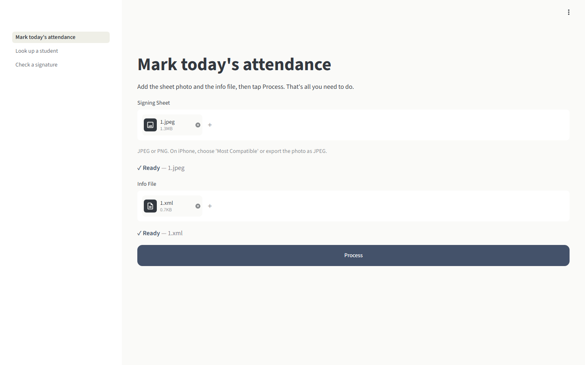<br/>
      <strong>Mark attendance</strong><br/>
      <sub>Upload sheet and roster</sub>
    </td>
    <td align="center" width="33%">
      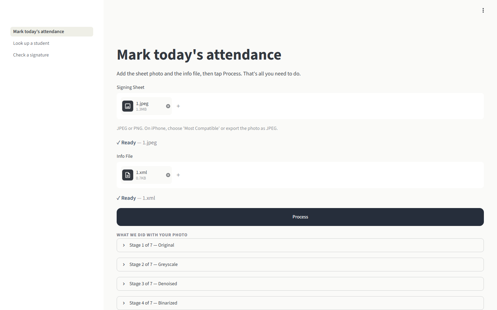<br/>
      <strong>Pipeline stages</strong><br/>
      <sub>All seven, then results</sub>
    </td>
  </tr>
  <tr>
    <td align="center" width="33%">
      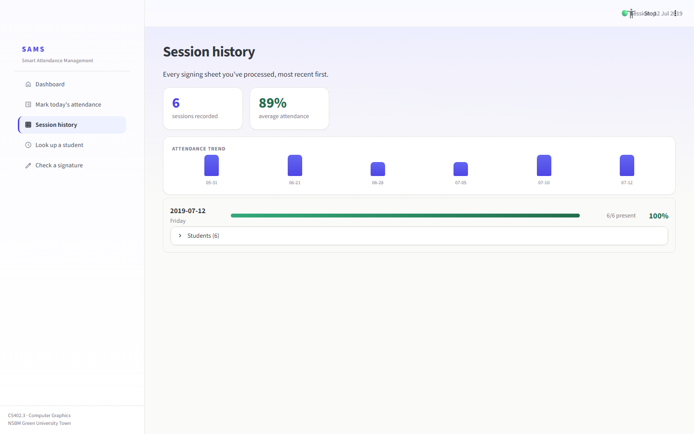<br/>
      <strong>Session history</strong><br/>
      <sub>Trend and per-session rates</sub>
    </td>
    <td align="center" width="33%">
      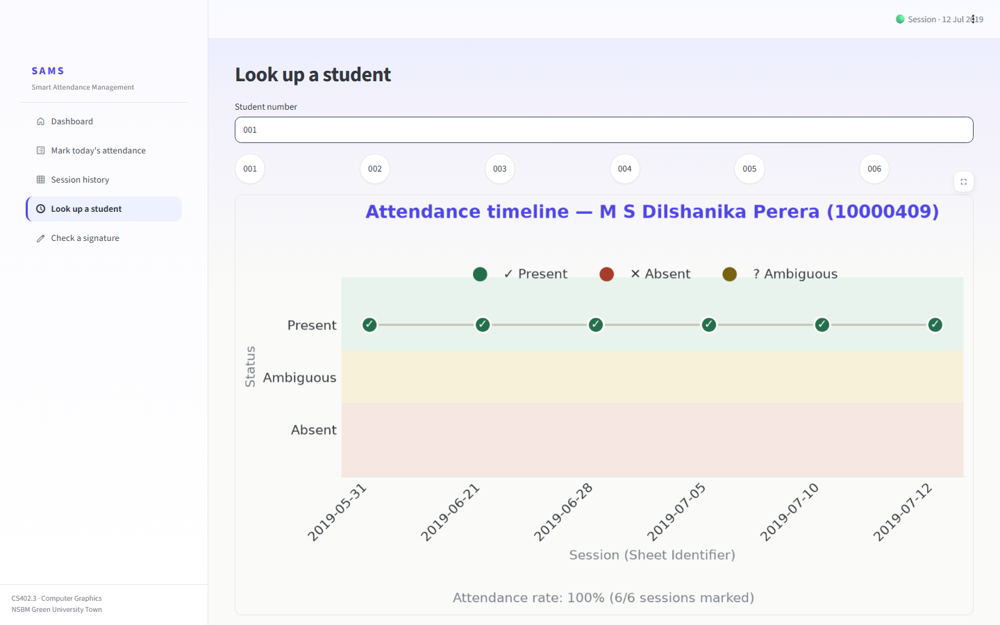<br/>
      <strong>Look up a student</strong><br/>
      <sub>Attendance timeline</sub>
    </td>
    <td align="center" width="33%">
      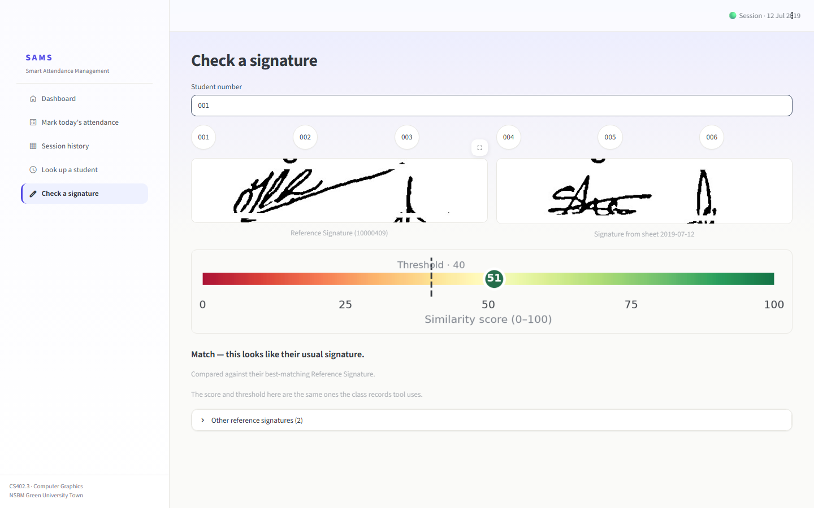<br/>
      <strong>Check a signature</strong><br/>
      <sub>Reference vs sheet, scored</sub>
    </td>
  </tr>
</table>

**On a phone**

<table>
  <tr>
    <td align="center">
      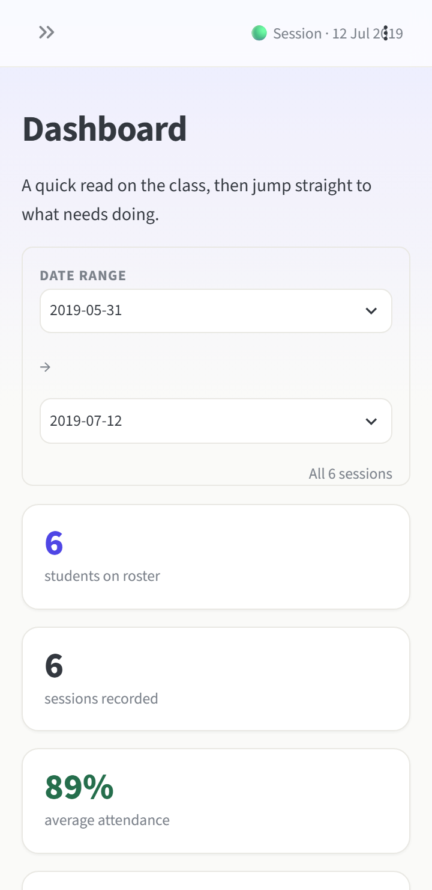<br/>
      <sub>Dashboard</sub>
    </td>
    <td align="center">
      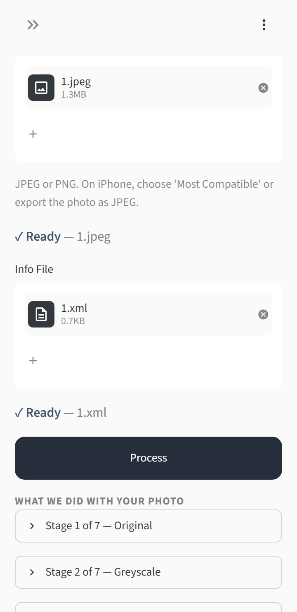<br/>
      <sub>Results</sub>
    </td>
    <td align="center">
      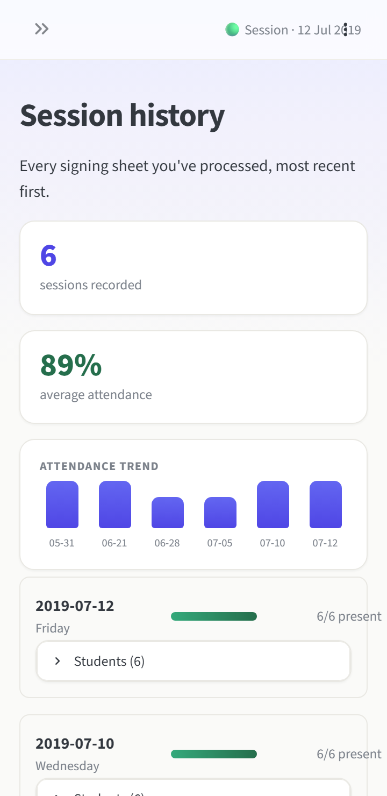<br/>
      <sub>History</sub>
    </td>
    <td align="center">
      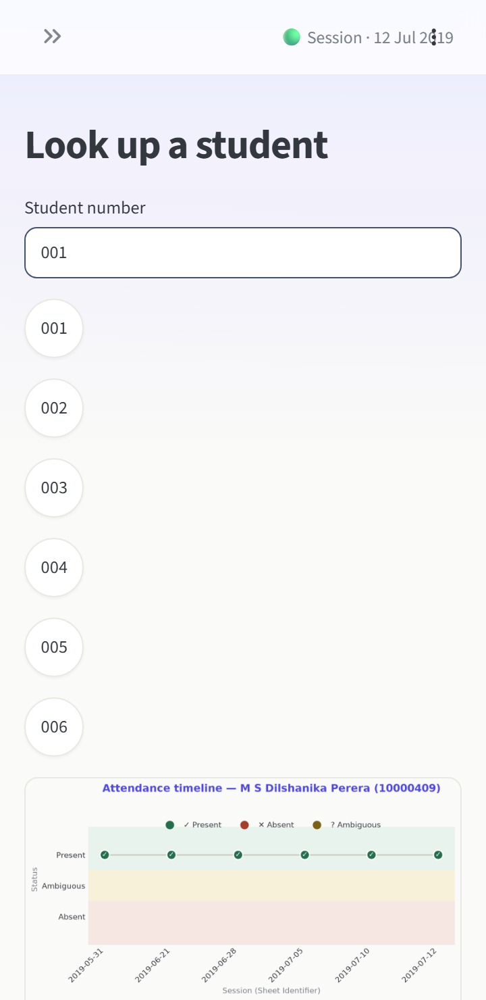<br/>
      <sub>Lookup</sub>
    </td>
  </tr>
</table>

</div>

---

## 🏗️ How it works

<div align="center">
  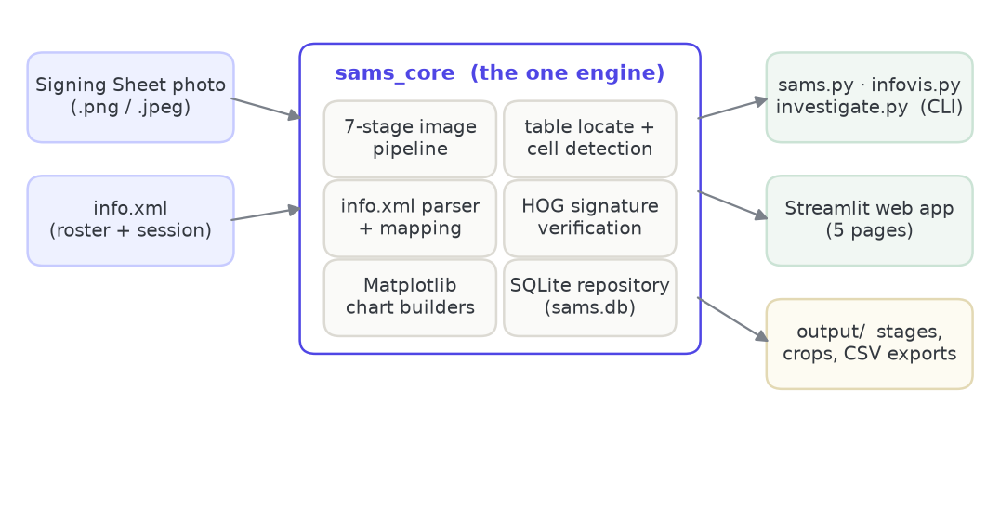
</div>

`sams_core/` is the engine — the only package that touches OpenCV, SQLite, or Matplotlib, and it
returns data rather than drawing anything itself. The CLI tools and the web app are thin adapters
over it.

---

## 🚀 Quick start

Needs **Python 3.12 or 3.13**. On Linux, also `sudo apt install libgl1 libglib2.0-0`.

```bash
pip install -r requirements.txt
```

Then, from the project root:

```bash
# 1. Read a signing sheet and save the attendance
python sams.py 10.07.2019.png info.xml

# 2. Show one student's records and attendance timeline
python infovis.py 001

# 3. Check that student's signature against their references
python investigate.py 001
```

Five more sample sheets to try are in `sample_signin-sheets/` — pass a photo and its matching
`.xml`, for example `python sams.py sample_signin-sheets/1.jpeg sample_signin-sheets/1.xml`.

---

## 🌐 Web UI

The browser front-end is an optional extra — the command-line tools never need it.

```bash
pip install -r requirements-web.txt
streamlit run webui/app.py
```

Run it from the project root so Streamlit picks up the theme in `.streamlit/`.

---

## 🛠️ Built with

- **Python** 3.12 / 3.13
- **OpenCV** — the image-processing pipeline and signature descriptors
- **NumPy** — the numerics underneath it
- **Matplotlib** — every chart
- **Streamlit** — the optional web front-end
- **SQLite** — the attendance records
- **pytest** — 269 tests, including an accuracy gate on the sample sheets

---

> 📄 Pipeline internals, configuration, accuracy results, the full CLI reference and deployment:
> **[docs/TECHNICAL.md](docs/TECHNICAL.md)**

---

## 👥 Team Members

<div align="left">

|  |  |  |  |
|:---:|:---:|:---:|:---:|
| **Lakshitha Wijerathne** | **Jayani Adikari** | **Nethmi Jayasinghe** | **Ruwani Chandrarathne** |
| [@lakshitha-dev](https://github.com/lakshitha-dev) | [@JMAdikari](https://github.com/JMAdikari) | [@NethmiJayasinghee](https://github.com/NethmiJayasinghee) | [@RuwaniChandrarathne](https://github.com/RuwaniChandrarathne) |

|  |  |  |  |
|:---:|:---:|:---:|:---:|
| **Janandi Samarawickrama** | **Chamudi Rathnayake** | **Dhananja Gangoda** | **Imashi Chathurangi Gunarathna** |
| [@Janandie](https://github.com/Janandie) | [@ChamudiRathnayake](https://github.com/ChamudiRathnayake) | [@DhananjaGangoda](https://github.com/DhananjaGangoda) | [@Imashichathu](https://github.com/Imashichathu) |

</div>

All eight members contributed to both halves of the module — the image-processing pipeline and the
data-visualization work.

---

<div align="center">
  <sub><strong>CS402.3 — Computer Graphics and Visualization</strong><br/>
  NSBM Green University Town</sub>
</div>
