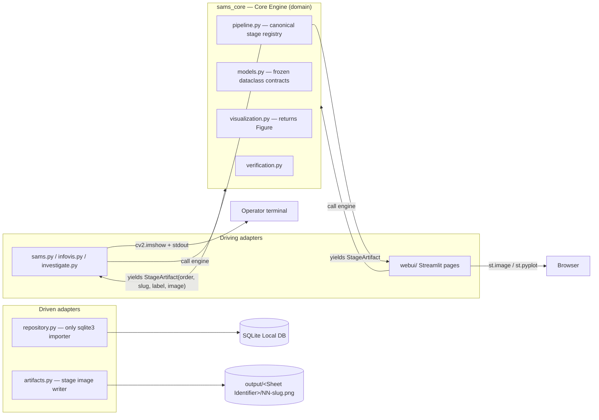
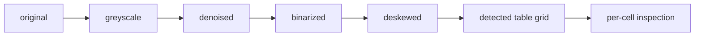

# Architecture Spine — SAMS (CGV Group Assignment)

## Design Paradigm

**Ports & Adapters (hexagonal).** `sams_core/` is the domain — pure Python, no UI framework imports. Driving adapters: the three CLI entry scripts and the Streamlit pages. Driven adapters: the SQLite repository and the filesystem artifact writer.



## Inherited Invariants

| Inherited | From | Binds here |
| --- | --- | --- |
| Stack fence: Python; OpenCV+NumPy, Matplotlib, SQLite, stdlib XML; no OCR, no cloud, no auth | PRD / coursework brief | Technology choices for all units |
| Three brief-verbatim CLI entry points + command forms; fresh-machine `pip install -r requirements.txt` | Coursework brief, PRD FR-15 | Repo root layout, packaging, install path |
| Core Engine owns detection/persistence/visualization/verification; frontends thin; engine emits labelled stage artifacts, never opens display windows; CLI-vs-Web parity at data layer | PRD FR-15/FR-16 + UX spines | AD-1, AD-7; every frontend unit |
| Streamlit multipage Web UI (resolves OQ-3); 3 pages Process/Lookup/Investigate; per-sheet stage folders `output/<Sheet Identifier>/NN-stage.png`; CLI `--overwrite` semantics; Ambiguous is a first-class persisted status; one-shot Process fenced from Streamlit reruns | UX spines (final) | webui/ pages, AD-3, AD-4 |
| Web UI gated behind SM-1..SM-3 passing on all 5 sample sheets; fallback deliverable is engine+CLI only | PRD §6.3 | Build sequencing |
| Glossary terms used verbatim in code and docs | PRD §3 / §6.3 | All naming, everywhere |

## Invariants & Rules

### AD-1 — Ports & Adapters boundary [ADOPTED: PRD FR-15/FR-16]

- **Binds:** all
- **Prevents:** engine logic leaking into frontends; frontends diverging from shared behavior
- **Rule:** all new logic lives in `sams_core/`; entry scripts and Streamlit pages stay thin (parse input → call engine → render; entry scripts <50 lines). `sams_core` never imports streamlit or any UI framework.

### AD-2 — Data contracts in models.py

- **Binds:** all cross-module data
- **Prevents:** bare dict/tuple contracts diverging between 10 authors
- **Rule:** cross-boundary data passes only as frozen dataclasses + enums defined in `sams_core/models.py`: `AttendanceStatus` (PRESENT/ABSENT/AMBIGUOUS), `StudentRecord`, `AttendanceRecord` (carries session/subject metadata), `StageArtifact(order: int, slug: str, label: str, image: ndarray)` — `image` is display-ready uint8: 2D grayscale or 3-channel **RGB**; adapters own toolkit conversion (CLI converts RGB→BGR for `cv2.imshow`; `artifacts.py` converts for `cv2.imwrite`; `st.image` consumes RGB as-is), `SheetResult` (includes `warnings: list[str]` — non-fatal anomalies such as row-count mismatch; processing completes), `ReferenceScore(reference_path, score: float 0–1)`, `VerificationResult(best: ReferenceScore, all_scores: list[ReferenceScore], matched: bool, threshold: float)`. No module defines its own cross-boundary shape.

### AD-3 — One canonical pipeline registry

- **Binds:** FR-2, FR-3, FR-11, FR-16
- **Prevents:** CLI and Web UI disagreeing on stage list/labels/order
- **Rule:** processing is a generator (or callback-fed runner) yielding `StageArtifact` from the single ordered stage registry in `pipeline.py` — names/slugs/order defined exactly once, glossary-verbatim. Stages are pure functions, ndarray-in/ndarray-out. The pipeline emits exactly the 7 registry stages, one `StageArtifact` each (per-cell inspection = one composite overlay image); signature crops are NOT StageArtifacts — they flow through `artifacts.py` separately (AD-10).



### AD-4 — Single DB gateway + overwrite semantics [overwrite: ADOPTED from UX]

- **Binds:** FR-6, FR-13, all persistence
- **Prevents:** two DB access styles, duplicate rows, silent loss of hand resolutions
- **Rule:** all Local DB access goes through `sams_core/repository.py` — the only module importing `sqlite3`. Schema auto-created (`ensure_schema` on open). Attendance upsert keyed (Student Index, Sheet Identifier). Operator resolutions carry `resolved_by_operator` and survive re-processing unless `overwrite=True` is passed explicitly (CLI `--overwrite` / Web UI confirm). Read APIs: `list_students()` and `has_operator_resolutions(sheet_id)` (needed pre-Process for the overwrite warning). Signature image metadata (paths) is registered in the DB; no image blobs in the DB. DB file path comes from `config.py`. The canonical 8-digit Student Index is the ONLY key form stored/queried in the Local DB; the short ordinal (`002`) is an input alias resolved by ONE engine resolver (`models.py` or repository) before any read/write — no adapter parses index forms itself. Write API: `resolve(sheet_id, student_index, status, by_operator=True)` with undo restoring Ambiguous. SQLite connections are per-operation via context manager — no cached, global, or long-lived connections (Streamlit worker threads + concurrent CLI access safety).

### AD-5 — Config ownership

- **Binds:** every tunable; SM-C1
- **Prevents:** `sams.py` and `investigate.py` silently using different thresholds; sample-sheet overfitting
- **Rule:** every tunable (Ambiguous coverage bands, similarity threshold, binarization/deskew params, DB path, output dir) is a named constant in `sams_core/config.py`; no numeric literals in stage/verification code. SM-C1 anti-overfitting binds here: no hard-coded pixel coordinates, no per-sheet special-casing, no per-image thresholds — all tunables global. All filesystem paths relative to project root (FR-15 portability).

### AD-6 — Error strategy

- **Binds:** all
- **Prevents:** raw stack traces reaching the grader; inconsistent error surfaces
- **Rule:** exception hierarchy in `sams_core/errors.py` — `SamsError` base; `InputError` (bad image/Info File); `ProcessingError` (pipeline failure). Exceptions ONLY for cannot-proceed failures; non-fatal anomalies (row-count mismatch et al.) are `SheetResult.warnings`, never exceptions. Unknown Student Index is NOT an error: lookup APIs return a no-data result carrying valid indices from `repository.list_students()`; CLI prints a friendly list + exits 0; Web renders the no-data state. Known-index-but-no-probe-yet and empty/missing references are the same no-data result family, never exceptions. Engine raises, never prints/exits/shows UI. CLI translates to one-line stderr + exit codes (0 ok, 2 input error, 1 other); CLI success line reports record count + resolved Sheet Identifier. Web UI translates to UX error-catalog strings.

### AD-7 — Display boundary [ADOPTED: PRD FR-16 + UX CLI Display Contract]

- **Binds:** all rendering
- **Prevents:** engine unusable headless; double rendering paths
- **Rule:** `sams_core` never imports streamlit, never calls `cv2.imshow` or `plt.show`. `visualization.py` returns matplotlib `Figure` objects; `artifacts.py` owns saving stage images to `output/<Sheet Identifier>/NN-slug.png`. CLI renders OpenCV windows + per-student stdout summary; Web UI renders `st.image` / `st.pyplot`. CLI stage windows are shown live DURING processing, each titled with its stage name — saving alone does not satisfy FR-11. `infovis.py`/`investigate.py` CLI adapters display returned Figures via matplotlib's `show`; Web uses `st.pyplot`.

### AD-8 — Dependency isolation [ADOPTED: PRD FR-15]

- **Binds:** all imports and packaging
- **Prevents:** web deps breaking the graded install path
- **Rule:** `sams_core` + CLI import only cv2/numpy/matplotlib/sqlite3/stdlib (pinned in `requirements.txt`). Streamlit lives only in `requirements-web.txt` and is imported only from `webui/`. The grader install stays `pip install -r requirements.txt` with zero web dependencies.

### AD-9 — Testing seam

- **Binds:** tests/, SM-1..SM-4, verification.py
- **Prevents:** the PRD §6.3 gate being judged by eyeball; untestable engine; frontends re-implementing match logic
- **Rule:** pytest; tests import `sams_core` only (no CLI/web). `tests/test_accuracy.py` computes SM-1..SM-3 against `tests/data/ground_truth.csv` across all five sample sheets (Disputed rows excluded from SM-1 scoring) — the gate is executable. Multi-reference comparison and best-match selection live IN the engine (`verification.py`); frontends render only. Similarity score is 0–1, HIGHER = more similar; `matched = score >= threshold`; any distance metric is normalized/inverted inside `verification.py` before leaving the engine. Verification evaluation is disjoint: references from sheets 1–3, probes from sheets 4–5 (FR-9/SM-4). Stage purity (AD-3) provides unit seams.

### AD-10 — Signature image data ownership

- **Binds:** verification.py, artifacts.py, repository.py, webui Investigate
- **Prevents:** three modules inventing three storage layouts
- **Rule:** Reference Signatures live on the filesystem at `references/<student_index>/`, pre-populated by the team from sheets 1–3 and committed to the repo (FR-9 contract); the engine only reads + registers metadata. Empty/missing references for a known student = a no-data result (same pattern as unknown index, AD-6), never an exception. Probe crops extracted during per-cell inspection are saved by `artifacts.py` to `output/<Sheet Identifier>/crops/<student_index>.png`. Both are registered as path metadata via `repository.py` and retrievable by Student Index. No image blobs in the DB.

### AD-11 — Sheet Identifier resolution

- **Binds:** CLI arg surface, Web pre-Process check, repository keying
- **Prevents:** divergent sheet keys for the same sheet
- **Rule:** the Sheet Identifier is resolved in the engine (`info_file.py` helper) BEFORE the pipeline runs; chain: Info File session date → operator-supplied (CLI `--date` flag / Web date field) → image filename stem normalized to ISO 8601 (accepts DD.MM.YYYY, e.g. `10.07.2019.png`). The filename-stem fallback applies to the CLI only; the Web UI (arbitrary upload filenames) requires Info File date or the operator date field — never the filename.

### AD-12 — Single engine entry point & persistence ownership

- **Binds:** sams.py, webui Process page, pipeline.py, repository.py
- **Prevents:** frontends disagreeing on who persists (Web-processed sheets silently unsaved)
- **Rule:** `process_sheet(image_path/bytes, info_file, sheet_id_override=None, overwrite=False)` in the engine is the ONE call both frontends make; it runs the pipeline, persists results internally on success (via repository), and returns `SheetResult`. Stage emission is a side channel (generator/callback); partial iteration/abort never persists.

## Consistency Conventions

| Concern | Convention |
| --- | --- |
| Naming | PRD §3 glossary terms verbatim in code, docs, DB columns, UI copy; stage slugs from the AD-3 registry; artifact files `NN-slug.png` |
| Data & formats | Sheet Identifier = ISO 8601 date; Student Index resolves both 8-digit and short-alias forms everywhere an index is accepted; all cross-boundary shapes per AD-2 |
| State & cross-cutting | DB only via AD-4; constants only via AD-5; errors only via AD-6; logging = stdlib `logging` default |
| Paradigm & style | OOP: cohesive classes for pipeline runner, repository, verifier (graded criterion); dataclasses for contracts |

## Stack

Versions verified on the web 2026-07-10; code owns this once it exists.

| Name | Version |
| --- | --- |
| Python | 3.12/3.13 ONLY (numpy 2.5.1 requires >=3.12) |
| opencv-python | 4.13.0.92 (current 4.x, primary pin); opencv-python 5.0.0.93 verified-compatible optional upgrade — core calls used (imread/cvtColor/threshold/findContours) identical |
| numpy | 2.5.1 |
| matplotlib | 3.11.0 (exact pin) |
| streamlit | 1.59.1 (requirements-web.txt only) — known upstream wart streamlit#11797: deep-linking sub-pages with custom [theme] may bounce to default page; non-blocking |
| sqlite3, xml | stdlib |
| pytest | unpinned (dev only) |

## Structural Seed

```text
CGV Group Assignment/
  sams.py                 # entry: process sheet (thin adapter)
  infovis.py              # entry: attendance graph (thin adapter)
  investigate.py          # entry: signature verification (thin adapter)
  sams_core/              # domain (the hexagon)
    config.py             # all tunables (AD-5)
    errors.py             # exception hierarchy (AD-6)
    models.py             # cross-boundary contracts (AD-2)
    info_file.py          # Info File (XML) parsing
    pipeline.py           # canonical stage registry (AD-3)
    locate.py             # table/cell localization
    detect.py             # signature presence detection
    mapping.py            # detections → Student Records
    repository.py         # sole sqlite3 gateway (AD-4)
    visualization.py      # returns Figure objects (AD-7)
    verification.py       # signature comparison
    artifacts.py          # stage image writer (AD-7)
  webui/
    app.py                # streamlit entry
    pages/                # Process / Lookup / Investigate
  references/             # Reference Signatures: references/<student_index>/ (AD-10)
  tests/
    test_accuracy.py      # executable SM-1..SM-3 gate (AD-9)
    data/
      ground_truth.csv    # committed BEFORE threshold tuning (AD-9)
  requirements.txt        # engine + CLI pins (grader path)
  requirements-web.txt    # streamlit (additive)
```

## Operational Envelope

Runs locally on student machines and the grader's fresh machine; no cloud, no CI mandated. Web UI runs via `streamlit run` on localhost/LAN only, and is built only after the PRD §6.3 gate (SM-1..SM-3 on all five sample sheets) passes. Build sequencing: `tests/data/ground_truth.csv` is committed BEFORE threshold tuning (Disputed rows excluded from SM-1 scoring). Deliverable packaging: outer LMS ZIP containing the prototype zip + MS Word report.

## Capability → Architecture Map

| Capability | Lives in | Governed by |
| --- | --- | --- |
| FR-1..FR-3 ingestion, preprocessing, localization | info_file.py, pipeline.py, locate.py | AD-3, AD-5, AD-11, AD-12 |
| FR-4..FR-5 detection + mapping | detect.py, mapping.py | AD-2, AD-5 |
| FR-6 persistence | repository.py | AD-4, AD-12 |
| FR-7..FR-8 query + graph | repository.py, visualization.py | AD-4, AD-7 |
| FR-9..FR-10 verification | verification.py, artifacts.py | AD-2, AD-5, AD-9, AD-10 |
| FR-11, FR-16 stage display | pipeline.py, artifacts.py | AD-3, AD-7 |
| FR-12..FR-14 Web UI | webui/ | AD-1, AD-7, AD-8, AD-12 |
| FR-15 parity + packaging | root entry scripts, requirements files | AD-1, AD-8, AD-12 |

## Deferred

Deliberately undecided at this altitude; each is a story-level call.

- Per-stage algorithm choices (Otsu vs adaptive threshold, denoise kernel) — behind AD-3's pure-function seam.
- Similarity metric internals for signature verification — behind `VerificationResult`.
- Streamlit session-state keys beyond the one-shot Process fence — webui/ internal.
- Logging framework — stdlib `logging` default stands until a story needs more.
- Info File schema evolution — pending module-leader override (PRD Appendix A).
- Packaging beyond requirements.txt — ZIP suffices for the brief.
