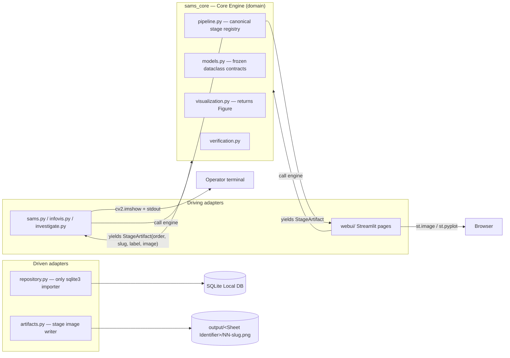

# Solution Design and Architecture

## 1. System Overview

The Student Attendance Management System (SAMS) converts a smartphone photograph of a paper Signing Sheet, together with an operator-supplied Info File (`info.xml`), into a persisted attendance record per student. The system processes the image through an ordered Processing Pipeline, decides whether each student is Present, Absent, or Ambiguous based on the appearance of a signature in that student's Signature Cell, stores each Attendance Record in a Local DB, renders an attendance summary graph for any Student Index, and — as the advanced component — compares a captured signature against stored Reference Signatures to report a match or mismatch verdict.

SAMS is structured as one Core Engine with two thin frontends. The Core Engine is a pure Python package (`sams_core/`) that owns all detection, persistence, visualization, and verification logic. The first frontend is the CLI: the three programs named verbatim in the coursework brief — `sams.py` (process a sheet), `infovis.py` (attendance graph), and `investigate.py` (signature verification) — each invoked exactly as the brief specifies. The second frontend is a Streamlit Web UI offering Process, Lookup, and Investigate pages for a non-technical operator in a browser.

This separation is deliberate rather than incidental. The assessment criteria grade the executable programs, the image-processing technique, and the code quality; they award nothing for a browser interface. The CLI is therefore the graded surface, and it is isolated from the ungraded Web UI at the dependency level: the Core Engine and CLI import only OpenCV, NumPy, Matplotlib, and the standard library, installed via `pip install -r requirements.txt` on a fresh machine, while Streamlit lives in a separate, additive `requirements-web.txt` and is imported only from `webui/`. A marker who never installs the web dependencies can still run every graded command. Because both frontends call the same engine, processing a sheet through either surface yields identical Attendance Records — parity is defined at the data layer, not at the pixel level.

## 2. Architectural Approach

The system follows the Ports & Adapters (hexagonal) style. The idea is straightforward: the domain logic sits at the centre with no knowledge of how it is invoked or where its data is stored; everything at the edges is an adapter. *Driving* adapters initiate work — here, the three CLI entry scripts and the Streamlit pages, each kept thin (parse input, call the engine, render the result). *Driven* adapters are called by the domain to reach the outside world — here, the SQLite repository (`repository.py`, the only module permitted to import `sqlite3`) and the filesystem artifact writer (`artifacts.py`, which saves each pipeline stage image to `output/<Sheet Identifier>/NN-slug.png`).

Within the hexagon, `pipeline.py` holds the single canonical registry of processing stages; `models.py` defines the frozen dataclass contracts that cross every boundary (such as `StageArtifact`, `SheetResult`, and `VerificationResult`); `visualization.py` builds Matplotlib `Figure` objects without displaying them; and `verification.py` owns signature comparison. The engine never opens a display window and never imports a UI framework — it emits labelled stage artifacts, and each adapter decides how to show them (OpenCV windows on the CLI, `st.image` in the browser).

The Processing Pipeline itself is a fixed, ordered sequence of seven stages, defined once in the registry so that the CLI and the Web UI can never disagree on stage names, labels, or order:

## 3. The Processing Pipeline

Each stage is a pure function (image array in, image array out) and yields exactly one labelled `StageArtifact`, which is both displayed live during processing and saved for the report screenshots. The image-processing intent of each stage is as follows. Where the choice of a specific algorithm or kernel is noted as open, it is implementation-determined behind the stage seam.

**Original.** The Signing Sheet photograph is loaded as supplied (JPEG or PNG) and emitted unmodified. This anchors the step-by-step record: every subsequent stage can be compared against the raw phone photo.

**Greyscale conversion.** The colour image is converted to a single-channel intensity image using OpenCV colour-space conversion (`cvtColor`). Students sign with pens of different colours, so attendance detection must not depend on hue; reducing to intensity makes all subsequent thresholding colour-agnostic while preserving the contrast between ink and paper.

**Noise reduction.** Smartphone photographs carry sensor noise, paper texture, and compression artefacts. A smoothing filter from OpenCV's denoising family suppresses these small-scale variations so that binarization does not amplify them into spurious foreground specks. The specific kernel choice is implementation-determined.

**Binarization.** The greyscale image is thresholded into a binary ink/background image using OpenCV's thresholding family; whether a global method such as Otsu's or an adaptive local threshold is used is implementation-determined, with the deciding factor being robustness to the uneven lighting seen in the sample photographs. Binarization is what turns "how dark is this pixel" into the categorical question the system actually needs: is this ink or not.

**Deskew / perspective correction.** Phone photographs are taken at an angle, so the sheet appears rotated and perspective-distorted. Geometric normalisation estimates the sheet's orientation and warps the image so the table becomes axis-aligned. This is essential preparation for grid detection: line-based table localisation assumes near-horizontal and near-vertical rulings.

**Table localization (detected table grid).** The student table is located structurally, using contour and line detection (OpenCV's `findContours` family) rather than any OCR of printed headings. The student table is identified as the five-column grid (No | Student No | Title | Student Name | Signature) below the four-column Metadata Row band, so the lecturer's details are never mistaken for a student row. Detected grid lines are masked out of each cell's region of interest so printed borders are never counted as handwritten ink. The column layout is fixed; the row count is dynamic per sheet.

**Per-cell inspection.** Each row's Signature Cell is examined for handwritten ink. Ink is segmented into connected components after grid-line masking, and each component is attributed to exactly one Signature Cell — real signatures on the sample sheets spill over cell borders, so cell regions are dilated and a majority-area rule assigns each stroke to a single row. Ink coverage is then classified against tunable thresholds: at or above the upper band is Present, at or below the lower band is Absent, and anything between is Ambiguous, flagged for operator resolution. The stage emits one composite overlay image showing every cell's decision.

## 4. Data Management

Persistence uses SQLite through a repository pattern: `sams_core/repository.py` is the sole module that imports `sqlite3`, giving the system exactly one data-access style and one place where the schema is defined. The schema is created automatically on first open, so the Local DB bootstraps on a fresh machine with no setup step. Connections are opened per operation via a context manager rather than cached, which keeps concurrent access from Streamlit worker threads and the CLI safe.

Attendance Records are keyed by (Student Index, Sheet Identifier), where the Sheet Identifier is the Session date in ISO 8601, resolved before the pipeline runs from the Info File's session date, falling back to an operator-supplied date, and finally (CLI only) to the image filename stem. Re-processing a sheet upserts rather than duplicates. Operator resolutions of Ambiguous rows are marked `resolved_by_operator` and survive re-processing unless the operator explicitly confirms an overwrite. The canonical 8-digit Student Index is the only key form stored; the brief's short ordinal (e.g. `002`) is an input alias resolved once, in the engine, before any read or write.

Signature imagery stays on the filesystem: Reference Signatures live under `references/<student_index>/`, and probe crops extracted during per-cell inspection are saved under `output/<Sheet Identifier>/crops/`. The Local DB stores only path metadata for both — no image blobs — keeping the database small and the images directly inspectable for the report.

## 5. Signature Verification Design

Verification (`investigate.py`) is a multi-reference comparison: the probe signature is compared against every stored Reference Signature for the Student Index, producing a `ReferenceScore` per reference, and the best-scoring reference determines the verdict. All comparison logic lives in the engine's `verification.py`; the frontends only render the result.

Score semantics are normalised at the engine boundary: the similarity score is always in the range 0–1 with higher meaning more similar, and any internal distance metric is inverted or rescaled inside `verification.py` before the result leaves the engine. The verdict is thresholded — `matched = score >= threshold` — with the threshold held as a named constant in configuration and documented against the evaluation protocol. The comparison method is drawn from OpenCV's feature-matching / image-similarity family, with the specific metric implementation-determined behind the `VerificationResult` contract. To avoid self-verification, references are cropped from sample sheets 1–3 and probes from sheets 4–5, with other students' signatures serving as impostor probes.

## 6. Key Design Decisions

| ID | Decision | Why it matters |
| --- | --- | --- |
| AD-1 | Ports & Adapters boundary: all logic in `sams_core/`; entry scripts and pages stay thin | Prevents engine logic leaking into frontends and the two surfaces diverging |
| AD-2 | Cross-boundary data passes only as frozen dataclasses/enums in `models.py` | Stops ten authors inventing incompatible dict/tuple shapes |
| AD-3 | One canonical pipeline registry yielding `StageArtifact`s; stages are pure functions | CLI and Web UI can never disagree on stage list, labels, or order |
| AD-4 | Single DB gateway (`repository.py`) with keyed upserts and explicit overwrite semantics | No duplicate rows; operator resolutions are never silently lost |
| AD-5 | Every tunable is a named constant in `config.py`; no numeric literals in stage code | The two CLIs share thresholds; blocks sample-sheet overfitting |
| AD-6 | Exception hierarchy; warnings for non-fatal anomalies; unknown index is a no-data result | The marker never sees a raw stack trace; error surfaces are consistent |
| AD-7 | Display boundary: engine returns Figures/artifacts, never shows UI | Engine stays headless-testable; one rendering contract serves both frontends |
| AD-8 | Dependency isolation: web packages confined to `requirements-web.txt` and `webui/` | The graded one-step install path carries zero web dependencies |
| AD-9 | Testing seam: executable accuracy gate against committed ground truth; match logic engine-side | The success-metric gate is judged by pytest, not by eyeball |
| AD-10 | Signature image data ownership: references and crops on the filesystem, path metadata in the DB | One storage layout instead of three; no blobs in the database |
| AD-11 | Sheet Identifier resolved in the engine before the pipeline runs (Info File → operator → filename) | The same sheet can never acquire divergent keys across surfaces |
| AD-12 | Single engine entry point `process_sheet(...)` that persists internally on success | Frontends cannot disagree on who saves; aborted runs never persist |

## 7. Technology Choices

Versions were verified on 2026-07-10 and pinned in `requirements.txt`.

| Technology | Version | Justification |
| --- | --- | --- |
| Python | 3.12/3.13 only | Required by NumPy 2.5.1; the brief's preferred language |
| opencv-python | 4.13.0.92 | The image-processing workhorse for every pipeline stage (5.0.0.93 verified compatible as an optional upgrade) |
| NumPy | 2.5.1 | Array representation for all image data and ink measurement |
| Matplotlib | 3.11.0 (exact pin) | Attendance summary graphs, returned as `Figure` objects per the display boundary |
| SQLite (`sqlite3`) | stdlib | Zero-install Local DB that bootstraps automatically on a fresh machine |
| `xml` | stdlib | Info File parsing with no extra dependency |
| Streamlit | 1.59.1 | Web UI only, in `requirements-web.txt`; fastest route to upload, live image display, and chart embedding |
| pytest | unpinned (dev only) | Drives the executable accuracy gate |

## 8. Quality and Testing Approach

Quality is enforced by an executable gate rather than by inspection. `tests/test_accuracy.py` computes the primary success metrics (SM-1 detection accuracy, SM-2 executable deliverables, SM-3 demonstrable stages) against a committed ground-truth answer key, `tests/data/ground_truth.csv`, across all five sample Signing Sheets. Tests import only `sams_core`, which the display boundary (AD-7) makes possible: the engine runs headlessly, so the suite needs no GUI.

Sequencing is ground-truth-first: the team adjudicates and commits the answer key *before* any detection threshold is tuned, so thresholds are fitted to an agreed target rather than the target being adjusted to fit the code (Disputed rows are excluded from SM-1 scoring and reported separately). An explicit anti-overfitting rule (SM-C1, bound into configuration by AD-5) forbids hard-coded pixel coordinates, per-sheet special-casing, and per-image thresholds — every tunable is a single global constant, because a general, technique-driven method is worth more against the learning outcomes than a brittle one that happens to pass the five samples. Verification is evaluated on a disjoint split (references from sheets 1–3, probes from sheets 4–5) so no signature is ever compared against itself. Finally, the Web UI is gated behind this test suite: browser work begins only once SM-1 to SM-3 pass on all five sheets, and the fallback deliverable — engine plus CLI — fully satisfies the brief on its own.